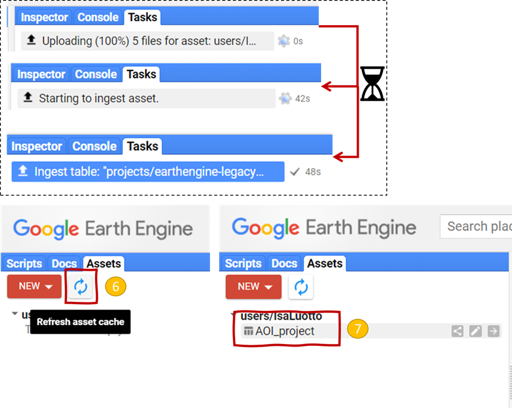

# Supplementary remote rensing indicators 

This document provides the scripts and a short user manual to derive the supplementary indicators for an SSM assessment through remote sensing. It is meant as a supplementary material to the User Manual of the SSM Protocol (reference here). 
The following indicators mentioned in the User Manual of the SSM Protocol will be used:

*   NDVI
*   BSI
*   NWI

Additionally, a short guide for the visualization and interpretation of the remotely sensed indicator is provided. 

## NDVI evolution within the project area using MODIS  
The following section presents a step by step guide to derive MODIS based spectral images to quantify changes in NDVI values linked to SSM for an entire project area. The MODIS product MOD09A1 is suggested due to its extensive time coverage (2000 to present time). A script to be imputed into Google Earth Engine is provided.  

The example area has undergone change in terms of land use (extensive pasture to a mosaic of silvopastoral areas and perennial crops).   

### Step 1 | Delineate the Area of Interest (AOI) in GEE:  

### Option 1: Drawing a geometry directly in GEE
To locate your Area of Interest (AOI), the search bar over the three windows can be used to find a reference location (Figure 1).


Below the three windows, a toolbar can be found. A geometry (marker, line, shape or rectangle) can be directly inputted into GEE by selecting the geometry type and drawing it directly into the map below (Figure 2). 


In this example, a geometry is added by clicking on the shape tool. The map view can be switched to satellite to ease delineation of the AOI. Once completed the script editor gets automatically updated (Figure 3).


### Option 2: Uploading a shapefile into GEE 
The Assets tab on the first window of GEE can be used to upload a shapefile. To upload click on: Assets >> New >> Shape files (Figure 4). 


After opening the asset window, click on upload, navigate to your shapefile with the file explorer, select all the accompanying files and click on ok. Scroll down the asset window and click on upload (Figure 5).


After clicking on upload, the shapefile will start ingesting. The progress of the file upload can be seen on the third window under the Task tab. Once the message ingest table under the Task section has turned blue the file can be seen by clicking on refresh, which is located in the first window under Assets (Figure 6). 


To import the shapefile, click on the shapefile name, scroll down the window and click on Import (Figure 7). 


The code editor will update automatically. In order to work directly with the provided script, the shapefile needs to be renamed to “area” (Figure 8).


### Step 2 | Copy, paste and run the provided scripts into GEE  
Once a geometry has been created or imported into GEE and renamed to “area”, the following script can be copied, pasted and runed into GEE without any modification. The script was designed to provide the following outputs for the AOI:

*   NDVI median values (two per month) over a specified time period that can be exported as a table and/or graph
*   A graph showing the mean yearly NDVI values
*   The selected NDVI images

To execute the script, copy the provided script below (Script 1) in its entirety, paste it into the code editor and click on Run (Figure 9).


### **Script 1: NDVI trend over a larger area with Modis**

```{js, eval=F, echo=T}
//++++++++++++++++++++++++++++++++++++++++++++++// 
// Script 1: NDVI trend over a larger area 
// with MODIS
// SSM-Prtocol 08/03/21
// This script was created by the GSP-Secretariat
// Authors: Luciano E. Di Paolo, Guillermo E. Peralta, Isabel Luotto. 
// Find out more about the Global Soil Partnership:
//
// http://www.fao.org/global-soil-partnership/en/ 
//
//++++++++++++++++++++++++++++++++++++++++++++++//

// Display yout Area of Interest (AOI)
Map.addLayer(area, {}, 'Area of interest');
//Zoom to layer

//Select MODIS images from MOD13Q1

var NDVIdata = ee.ImageCollection('MODIS/006/MOD13Q1')
.filterBounds(area)
    // Select the years to perform the analysis
    .filter(ee.Filter.calendarRange(2010,2020,'year'))
    //Select the months to perform the analysis
    .filter(ee.Filter.calendarRange(1,12,'month'));


// Extract NDVI layer from the Mod13.Q1 product (250m)
var ndvi = NDVIdata.select('NDVI');
var scale = function(image){
    return image.addBands (image.expression(
    'ndvi=b1*0.0001', {
      'b1': image.select('NDVI')}));
};


var ndvi = ndvi.map(scale);
var ndviMed= ndvi.median();
var ndviMed= ndviMed.clip(area);

// Show temporal median image of NDVI
Map.addLayer(ndviMed,{'bands': ['ndvi'],min: 0.0, max: 1, "palette":"FFFFFF, CE7E45, DF923D, F1B555, FCD163, 99B718, 74A901, 66A000, 529400, 3E8601, 207401, 056201, 004C00, 023B01, 012E01, 011D01, 011301"}, "NDVI temporal Median");

//Zoom to layer
Map.centerObject(area, 15); //Modify the zoom number depending on the size of the feature


// Download Temporal Median Images
var regionJSON = JSON.stringify(ndviMed.getInfo());
Export.image.toDrive({
          image: ndviMed.select("ndvi"),
          folder: "working_directory",
          description: 'NDVI_median_Modis_m01-m012_00-20', 
          scale: 250,
          region:area,
          maxPixels: 1e9

});

// Create a time series chart.
var plotNDVI = ui.Chart.image.seriesByRegion(ndvi, area,ee.Reducer.mean(),
'ndvi',250,'system:time_start','name')
              .setChartType('LineChart').setOptions({
                trendlines: {type: linear, 0: {color: 'CC0000'}, visibleInLegend: true},
                title: 'Mean Normalized Difference Vegetation Index ',
                hAxis: {title: 'Date'},
                vAxis: {title: 'NDVI'}
});

// Display.
print(plotNDVI);


```


### Step 3 | Export and analyse your output  
The resulting output can be viewed directly in the console tab in the third GEE window. To export the graph and data as an image and/or tabular data click on the arrow icon in the console (Figure 10). 


## Estimating and comparing the NDVI evolution over plots that have been subjected to SSM practices against control plots with a Sentinel product  

The following section presents a step by step guide to derive Sentinel-2 based spectral images to quantify and compare changes in NDVI values linked to SSM for two plots (one with SSM practices, and one without). In this case a Sentinel product is suggested due to its finer resolution (10 m). The Sentinel-2 mission started in 2015, meaning that for this example images from 2015 to 2020 will be selected. In the provided example we will be comparing two paddocks with contrasting management from 2010,  within a 40 hectares project: 

*   A grazing paddock (1 ha) with a degraded tropical pasture (Business as usual, BAU)
*   A paddock (1 ha) with a silvopastoral management, combining improved grass species, shrubs like Leucaena and trees like Glicirida to provide forage during the dry season (Sustainable Soil Management, SSM)

### Step 1 | Delineate two areas for comparison in GEE  
Draw two geometries directly into GEE using the Geometry Tools. Add a first geometry then click on + new Layer and draw a second one (Figure 11). 
Finally, change the geometry names to SSM and Control (Figure 12). Lines 20 and 21 of the provided script can be modified to change the names displayed in the output graph. 


### Step 2 | Copy, paste and run the provided scripts into GEE  
Once the two geometries have been created in GEE and renamed to “SSM” and “Control”, the following script can be copied, pasted and runed into GEE without any modification. The script was designed to provide the following outputs for the AOI:

*   Plot comparison of median NDVI  values (two per month) over a specified time period that can be exported as a table and/or graph
*   The selected NDVI images
*   A chart comparing mean yearly NDVI values for the SSM and the control plot
To execute the script, copy the provided script below (Script 2) in its entirety, paste it into the code editor and click on Run.

### **Script 2:  NDVI trend comparison over two plots with Sentinel**
```{js, eval=F, echo=T}
//++++++++++++++++++++++++++++++++++++++++++++++// 
// Script 2: NDVI trend comparison over two plots
// with Sentinel
// SSM-Prtocol 08/03/21
// This script was created by the GSP-Secretariat
// Authors: Luciano E. Di Paolo, Guillermo E. Peralta, Isabel Luotto
// Find out more about the Global Soil Partnership:
//
// http://www.fao.org/global-soil-partnership/en/ 
//
//++++++++++++++++++++++++++++++++++++++++++++++//


// Make a list of Features. 
// Draw the geometries that represent the plots to analyze (in this case SSM and Control).
// Remember to add a geometry to represent the "optimal" or "reference" area. 

//Create a feature list out of the drawn geometries
var featList = [
  ee.Feature(SSM, {name: 'SSM'}),
  ee.Feature(Control, {name: 'Control'})
];

var featColl = ee.FeatureCollection(featList);

print(featColl);


//SENTINEL 2
// This example uses the Sentinel-2 QA band to cloud mask
// the collection.  The Sentinel-2 cloud flags are less
// selective, so the collection is also pre-filtered by the
// CLOUDY_PIXEL_PERCENTAGE flag, to use only relatively
// cloud-free granule.

// Function to mask clouds using the Sentinel-2 QA band.
function maskS2clouds(image) {
  var qa = image.select('QA60')

  // Bits 10 and 11 are clouds and cirrus, respectively.
  var cloudBitMask = 1 << 10;
  var cirrusBitMask = 1 << 11;

  // Both flags should be set to zero, indicating clear conditions.
  var mask = qa.bitwiseAnd(cloudBitMask).eq(0).and(
             qa.bitwiseAnd(cirrusBitMask).eq(0))

  // Return the masked and scaled data, without the QA bands.
  return image.updateMask(mask).divide(10000)
      .select("B.*")
      .copyProperties(image, ["system:time_start"])
}


// Select images with the cloud mask
var filteredCollectionS2 = ee.ImageCollection('COPERNICUS/S2')
    .filterBounds(featColl)
    // Select the years to perform the analysis
    .filter(ee.Filter.calendarRange(2015,2020,'year'))
    //Select the months to perform the analysis
    .filter(ee.Filter.calendarRange(1,12,'month'))
    .filter(ee.Filter.lt('CLOUDY_PIXEL_PERCENTAGE', 20))
    .map(maskS2clouds);

// Define the NDVI function
var addNDVI = function(image) {
return image.addBands(image.normalizedDifference(['B8', 'B4']));
};

//Add indices to Image Collection
// (this can be used as placeholder for other indices)

var ImColl = filteredCollectionS2.map(addNDVI);

// Select the median of each image
var median = ImColl.median();

print(ImColl,"Image Collection");

// Show temporal median image of NDVI
Map.addLayer(featColl,{'bands': ['nd'],min: 0.0, max: 1, "palette":"FFFFFF, CE7E45, DF923D, F1B555, FCD163, 99B718, 74A901, 66A000, 529400, 3E8601, 207401, 056201, 004C00, 023B01, 012E01, 011D01, 011301"}, "NDVI temporal Median");

// Create a time series chart.
var plotNDVI = ui.Chart.image.seriesByRegion(ImColl, featColl,ee.Reducer.mean(),
'nd',20,'system:time_start','name')
              .setChartType('LineChart').setOptions({
                title: 'Normalize Difference Vegetation Index ',
                hAxis: {title: 'Date'},
                vAxis: {title: 'NDVI'}
});

// Display.
print(plotNDVI);

```

### Step 3 | Export and test for significant differences  
The graph and accompanying data can be viewed and exported from the console as shown in Step 3 of section 3.1.1. A short R script is provided as an example on how to test for the significance of the differences highlighted in the output GEE chart (Figure 13) (Script 2.1).


### **Script 2.1 Example of potential data visualization with the output csv file with a one-way Anova in R.**

```{r, eval=F, echo=T}
#Define a path to the file 
wd <- "C:/Path/Example_data"

#Use the path to define the working directory
setwd(wd)

#load the data
data <- read.csv("ee-chart.csv")

#Run a one-way ANOVA
anova <- aov(SSM ~ Control, data=data)
#Check if there's a significant effect
summary(anova) 

#Extract p-value
pvalue <-summary(anova)[[1]][["Pr(>F)"]]
pvalue <- ifelse(pvalue < 0.01, "p < 0.01",
                 ifelse(pvalue > 0.01 & pvalue < 0.05, 
                        "p < 0.05", "Not significant"))

#Create a boxplot with the p-value as annotation
boxplot(data$SSM , data$Control, frame = FALSE,
        names = c("SSM", "Control"), ylab = "NDVI series (2015-2020)")
mtext(pvalue, side=3)


```


## Estimating vegetation cover ratios to compare the effects of SSM    
Following the same steps explained in the section 3.1.1 and 3.1.2 an aggregated vegetation cover trend can be derived by estimating the mean yearly ratio of images over a certain threshold (e.g. NDVI > 0.3) to compare the performance of two plots using a Sentinel product (Script 3).  Aggregating the NDVI values represents a useful strategy to further highlight trends and evaluate differences linked to different management practices.
With the following script a chart comparing the yearly vegetation cover ratio from 2017 to 2020 can be created. 

### **Script 3:  Vegetation cover ratio trend comparison over two plots with Sentinel**

```{js, eval=F, echo=T}

//++++++++++++++++++++++++++++++++++++++++++++++// 
// Script 3: NDVI trend comparison over two plots
// with Sentinel (2017-2020)
// SSM-Prtocol 08/03/21
// This script was created by the GSP-Secretariat
// Authors: Luciano E Di Paolo, Guillermo E Peralta, Isabel Luotto
// Find out more about the Global Soil Partnership:
//
// http://www.fao.org/global-soil-partnership/en/ 
//
//++++++++++++++++++++++++++++++++++++++++++++++//


// Make a list of Features. 
// Draw the geometries that represents the plots to analyze( in this case L01 and L02).
// Remember to add a geometry to represent the "optimal" or "reference" area. 
//After drawing the geometries, change the names after the "name" variable. 

var featList = [
  ee.Feature(Control, {name: 'Control'}),
  ee.Feature(SSM, {name: 'SSM'})
];

var featColl = ee.FeatureCollection(featList);

print(featColl);

//SENTINEL 2


// This example uses the Sentinel-2 QA band to cloud mask
// the collection.  The Sentinel-2 cloud flags are less
// selective, so the collection is also pre-filtered by the
// CLOUDY_PIXEL_PERCENTAGE flag, to use only relatively
// cloud-free granule.

// Function to mask clouds using the Sentinel-2 QA band.
function maskS2clouds(image) {
  var qa = image.select('QA60')

  // Bits 10 and 11 are clouds and cirrus, respectively.
  var cloudBitMask = 1 << 10;
  var cirrusBitMask = 1 << 11;

  // Both flags should be set to zero, indicating clear conditions.
  var mask = qa.bitwiseAnd(cloudBitMask).eq(0).and(
             qa.bitwiseAnd(cirrusBitMask).eq(0))

  // Return the masked and scaled data, without the QA bands.
  return image.updateMask(mask).divide(10000)
      .select("B.*")
      .copyProperties(image, ["system:time_start"])
}


// Select images from a collection with a silder.

var filteredCollectionS2 = ee.ImageCollection('COPERNICUS/S2')
    .filterBounds(featColl)
    // Select the years to perform the analysis
    .filter(ee.Filter.calendarRange(2015,2020,'year'))
    //Select the months to perform the analysis
    .filter(ee.Filter.calendarRange(1,12,'month'))
    .filter(ee.Filter.lt('CLOUDY_PIXEL_PERCENTAGE', 20))
    .map(maskS2clouds);
    
// NDVI function
var addNDVI = function(image) {
return image.addBands(image.normalizedDifference(['B8', 'B4']));
};
// Add indexs to Image Collection

var ImColl = filteredCollectionS2.map(addNDVI);

var median = ImColl.median();
var Area_temp_median = median.clip(featColl);

//var plots_temp_median = Area_temp_median.clip(featColl);

print(ImColl,"Image Collection");

// Show temporal median image of NDVI
Map.addLayer(Area_temp_median,{'bands': ['nd'],min: 0.0, max: 1, "palette":"FFFFFF, CE7E45, DF923D, F1B555, FCD163, 99B718, 74A901, 66A000, 529400, 3E8601, 207401, 056201, 004C00, 023B01, 012E01, 011D01, 011301"}, "NDVI temporal Median");


// Show the total number of images in the collection
var ndColl=ImColl.select(['nd']);

print('Total number of NDVI images: ', ndColl.size());

// Define a mask using a threshold of 0.

var mask_ndvi= function(image) {
  var mask = image.select('nd').gt(0.3);
  return image.updateMask(mask);}

// NDVI PROPORTION 2017
var ImColl2017 = ImColl.filter(ee.Filter.calendarRange(2017,2017,'year'));


var ndColl2017=ImColl2017.select(['nd']);

//Apply the mask to the BSI Collection

var ndCollmasked17=ndColl2017.map(mask_ndvi); 

// Count the number of times that the threshold is surpased
var ndCollmasked_nn17=ndCollmasked17.reduce(ee.Reducer.count());

// Count the number of bsi images
var ndColl_nn17=ndColl2017.reduce(ee.Reducer.count());

// Calculate the proportion of times the bsi is greater than the threshold
var prop_ndvi_2017= ndCollmasked_nn17.divide(ndColl_nn17);

// Cut the BSI proportion by the area of interest

var prop_ndvi_rec2017 = prop_ndvi_2017.clip(featColl);

var prop_ndvi_rec2017 = prop_ndvi_rec2017.set({
  year: "2017"
});

prop_ndvi_rec2017 = ee.Image(prop_ndvi_rec2017)

Map.addLayer(prop_ndvi_rec2017,{'bands': ['nd_count'],min: 0.0, max: 1, palette:['011301','FFFFFF']}, "NDVI prop 2017");

// NDVI PROPORTION 2018
var ImColl2018 = ImColl.filter(ee.Filter.calendarRange(2018,2018,'year'));


var ndColl2018=ImColl2018.select(['nd']);

//Apply the mask to the BSI Collection

var ndCollmasked18=ndColl2018.map(mask_ndvi); 

// Count the number of times that the threshold is surpased
var ndCollmasked_nn18=ndCollmasked18.reduce(ee.Reducer.count());

// Count the number of bsi images
var ndColl_nn18=ndColl2018.reduce(ee.Reducer.count());

// Calculate the proportion of times the bsi is greater than the threshold
var prop_ndvi_2018= ndCollmasked_nn18.divide(ndColl_nn18);

// Cut the BSI proportion by the area of interest

var prop_ndvi_rec2018 = prop_ndvi_2018.clip(featColl);

Map.addLayer(prop_ndvi_rec2018,{'bands': ['nd_count'],min: 0.0, max: 1, palette:['011301','FFFFFF']}, "NDVI prop 2018");

var prop_ndvi_rec2018 = prop_ndvi_rec2018.set({
  year: "2018"
});

prop_ndvi_rec2018 = ee.Image(prop_ndvi_rec2018);


// NDVI PROPORTION 2019
var ImColl2019 = ImColl.filter(ee.Filter.calendarRange(2019,2019,'year'));

var ndColl2019=ImColl2019.select(['nd']);

//Apply the mask to the BSI Collection

var ndCollmasked19=ndColl2019.map(mask_ndvi); 

// Count the number of times that the threshold is surpased
var ndCollmasked_nn19=ndCollmasked19.reduce(ee.Reducer.count());

// Count the number of bsi images
var ndColl_nn19=ndColl2019.reduce(ee.Reducer.count());

// Calculate the proportion of times the bsi is greater than the threshold
var prop_ndvi_2019= ndCollmasked_nn19.divide(ndColl_nn19);

// Cut the BSI proportion by the area of interest

var prop_ndvi_rec2019 = prop_ndvi_2019.clip(featColl);

Map.addLayer(prop_ndvi_rec2019,{'bands': ['nd_count'],min: 0.0, max: 1, palette:['011301','FFFFFF']}, "NDVI prop 2019");

var prop_ndvi_rec2019 = prop_ndvi_rec2019.set({
  year: "2019"
});

prop_ndvi_rec2019 = ee.Image(prop_ndvi_rec2019);

// NDVI PROPORTION 2020
var ImColl2020 = ImColl.filter(ee.Filter.calendarRange(2020,2020,'year'));

var ndColl2020=ImColl2020.select(['nd']);

//Apply the mask to the BSI Collection

var ndCollmasked20=ndColl2020.map(mask_ndvi); 

// Count the number of times that the threshold is surpased
var ndCollmasked_nn20=ndCollmasked20.reduce(ee.Reducer.count());

// Count the number of bsi images
var ndColl_nn20=ndColl2020.reduce(ee.Reducer.count());

// Calculate the proportion of times the bsi is greater than the threshold
var prop_ndvi_2020= ndCollmasked_nn20.divide(ndColl_nn20);

// Cut the BSI proportion by the area of interest

var prop_ndvi_rec2020 = prop_ndvi_2020.clip(featColl);

Map.addLayer(prop_ndvi_rec2020,{'bands': ['nd_count'],min: 0.0, max: 1, palette:['011301','FFFFFF']}, "NDVI prop 2020");

var prop_ndvi_rec2020 = prop_ndvi_rec2020.set({
  year: "2020"
});

prop_ndvi_rec2020 = ee.Image(prop_ndvi_rec2020);

// Create a new Image Collection

var NDVIpropColl1720 = ee.ImageCollection([prop_ndvi_rec2017, prop_ndvi_rec2018,prop_ndvi_rec2019,prop_ndvi_rec2020]);
print('NDVI prop collection: ', NDVIpropColl1720 );

// Create a time series chart.
var plotprop = ui.Chart.image.seriesByRegion(NDVIpropColl1720, featColl,ee.Reducer.mean(),
'nd_count',20,'year','name')
              .setChartType('LineChart').setOptions({
                title: 'Proportion of images with NDVI>0.3',
                hAxis: {title: 'Date'},
                vAxis: {title: 'NDVI>0.3/count(NDVI)'}
});

// Display.
print(plotprop);


```

## Assessing SSM through Bare Soil Index (BSI)  
Following the same steps presented in the previous sections the Bare Soil Index trend can be derived either for one area that encompasses the whole project (Script 4) using a MODIS product or to compare the performance a plot with SSM practices against a control plot (Script 6) using a Sentinel product. 

### **Script 4:  Bare Soil Index  trend comparison for the whole area using MODIS**

```{js, eval=F, echo=T}
//++++++++++++++++++++++++++++++++++++++++++++++// 
// Script 5: BSI trend over a larger area 
// with MODIS
// SSM-Prtocol 08/03/21
// This script was created by the GSP-Secretariat
// Find out more about the Global Soil Partnership:
//
// http://www.fao.org/global-soil-partnership/en/ 
//
//++++++++++++++++++++++++++++++++++++++++++++++//

// Area of Interest
Map.addLayer(area, {}, 'Area of interest');


// MODIS MOD09A1 product

var dataset = ee.ImageCollection('MODIS/006/MOD09A1')
.filterBounds(area)
    // Select the years to perform the analysis
    .filter(ee.Filter.calendarRange(2015,2020,'year'))
    //Select the months to perform the analysis
    .filter(ee.Filter.calendarRange(1,12,'month'));

//Bare Soil Index (BSI):
// (BSI) 
//Fórmula del BSI = ((Red+SWIR2) - (NIR+Blue)) / ((Red+SWIR2) + (NIR+Blue))
// BSI (Modis) = (B1 + B7) - (B2 + B3) / (B1 + B7) + (B2 + B3)
var addBSI = function(image){
    return image.addBands (image.expression(
    'bsi=((b1 + b7)-(b2+b3))/((b1 + b7)+(b2+b3))', {
      'b7': image.select('sur_refl_b07'), // SWIR2
      'b1': image.select('sur_refl_b01'), // Red
      'b3': image.select('sur_refl_b03'), //BLUE
      'b2':image.select('sur_refl_b02')}));//NIR
      
};


// Add indexs to Image Collection
var ImColl = dataset.map(addBSI);

// Calculate the median of the time series of the indexes
var median = ImColl.median();
var Area_temp_median = median.clip(area);

print(ImColl,"Image Collection");

// Show the total number of images in the collection
var bsiColl=ImColl.select(['bsi']);

print('Total number of BSI images: ', bsiColl.size());


// Create a time series chart.
var plotBSI = ui.Chart.image.seriesByRegion(ImColl, area,ee.Reducer.mean(),
'bsi',500,'system:time_start','name')
              .setChartType('LineChart').setOptions({
                title: 'Bare Soil Index',
                hAxis: {title: 'Date'},
                vAxis: {title: 'BSI'}
});

// Display.
print(plotBSI);

// Display.
print(plotBSI);

```

### **Script 5:  Bare Soil Index trend comparison over two plots with Sentinel** 

```{js, eval=F, echo=T}
//++++++++++++++++++++++++++++++++++++++++++++++// 
// Script 5: BSI trend comparison over two plots
// with Sentinel
// SSM-Prtocol 08/03/21
// This script was created by the GSP-Secretariat
// Find out more about the Global Soil Partnership:
//
// http://www.fao.org/global-soil-partnership/en/ 
//
//++++++++++++++++++++++++++++++++++++++++++++++//


// Make a list of Features. 
// Draw the geometries that represents the plots to analyze (in this case SSM and Control).
// Remember to add a geometry to represent the "optimal" or "reference" area. 

//Create a feature list out of the drawn geometries
var featList = [
  ee.Feature(SSM, {name: 'SSM'}),
  ee.Feature(Control, {name: 'Control'})
];

var featColl = ee.FeatureCollection(featList);

print(featColl);


//SENTINEL 2


// This example uses the Sentinel-2 QA band to cloud mask
// the collection.  The Sentinel-2 cloud flags are less
// selective, so the collection is also pre-filtered by the
// CLOUDY_PIXEL_PERCENTAGE flag, to use only relatively
// cloud-free granule.

// Function to mask clouds using the Sentinel-2 QA band.
function maskS2clouds(image) {
  var qa = image.select('QA60')

  // Bits 10 and 11 are clouds and cirrus, respectively.
  var cloudBitMask = 1 << 10;
  var cirrusBitMask = 1 << 11;

  // Both flags should be set to zero, indicating clear conditions.
  var mask = qa.bitwiseAnd(cloudBitMask).eq(0).and(
             qa.bitwiseAnd(cirrusBitMask).eq(0))

  // Return the masked and scaled data, without the QA bands.
  return image.updateMask(mask).divide(10000)
      .select("B.*")
      .copyProperties(image, ["system:time_start"])
}


// Select images from a collection with a silder.

var filteredCollectionS2 = ee.ImageCollection('COPERNICUS/S2')
    .filterBounds(featColl)
    // Select the years to perform the analysis
    .filter(ee.Filter.calendarRange(2015,2020,'year'))
    //Select the months to perform the analysis
    .filter(ee.Filter.calendarRange(1,12,'month'))
    .filter(ee.Filter.lt('CLOUDY_PIXEL_PERCENTAGE', 20))
    .map(maskS2clouds);

//Bare Soil Index (BSI):
// (BSI) (GU, 2019).
//Fórmula del BSI = ((Red+SWIR2) - (NIR+Blue)) / ((Red+SWIR2) + (NIR+Blue))
// BSI (Sentinel 2) = (B12 + B4) - (B8 + B2) / (B12 + B4) + (B8 + B2)
var addBSI = function(image){
    return image.addBands (image.expression(
    'bsi=((b12 + b4)-(b8+b2))/((b12 + b4)+(b8+b2))', {
      'b12': image.select('B12'),
      'b4': image.select('B4'),
      'b8': image.select('B8'),
      'b2':image.select('B2')}));
      
};


// Add indexs to Image Collection

var ImColl = filteredCollectionS2.map(addBSI);

var median = ImColl.median();
var Area_temp_median = median.clip(featColl);

//var plots_temp_median = Area_temp_median.clip(featColl);

print(ImColl,"Image Collection");


// Show the total number of images in the collection
var bsiColl=ImColl.select(['bsi']);

print('Total number of BSI images: ', bsiColl.size());


var regionJSON = JSON.stringify(Area_temp_median.getInfo());
Export.image.toDrive({
          image: Area_temp_median.select("bsi"),
          folder: "working_directory",
          description: 'BSI_median_S2_m01-m012_15-20', 
          scale: 20,
          region:featColl,
          maxPixels: 1e9

});


// Create a time series chart.
var plotBSI = ui.Chart.image.seriesByRegion(ImColl, featColl,ee.Reducer.mean(),
'bsi',20,'system:time_start','name')
              .setChartType('LineChart').setOptions({
                title: 'Bare Soil Index',
                hAxis: {title: 'Date'},
                vAxis: {title: 'BSI'}
});

// Display.
print(plotBSI);


```

## Assessing SSM through the Normalized Difference Water Index (NDWI)  

Following the same steps presented in the previous sections, the NDWI trend can be derived either for one area that encompasses the whole project (Script 6) using a MODIS product or to compare the performance of a plot with SSM practices against a control plot (Script 7) using a Sentinel product. 

### **Script 6:  NDWI  trend comparison for the whole area using MODIS**

```{js, eval=F, echo=T}
//++++++++++++++++++++++++++++++++++++++++++++++// 
// Script 6: NDWI trend over a larger area 
// with MODIS
// SSM-Prtocol 09/03/21
// This script was created by the GSP-Secretariat
// Authors: Luciano E. Di Paolo, Guillermo E. Peralta, Isabel Luotto. 
// Find out more about the Global Soil Partnership:
//
// http://www.fao.org/global-soil-partnership/en/ 
//
//++++++++++++++++++++++++++++++++++++++++++++++//

// Display yout Area of Interest (AOI)
Map.addLayer(area, {}, 'Area of interest');
//Zoom to layer

//Load images from MODIS MOD09A1 product

var dataset = ee.ImageCollection('MODIS/006/MOD09A1')
.filterBounds(area)
    // Select the years to perform the analysis
    .filter(ee.Filter.calendarRange(2010,2020,'year'))
    //Select the months to perform the analysis
    .filter(ee.Filter.calendarRange(1,12,'month'));


// NDWI = (NIR - SWIR2) / (NIR + SWIR2)  Gao (1996)
// NDWI (Modis) = (B2 - B7) / (B2 + B7)
var addNDWI = function(image){
    return image.addBands (image.expression(
    'ndwi=(b2 - b7)/(b2 + b7)', {
      'b2': image.select('sur_refl_b02'),
      'b7': image.select('sur_refl_b07')}));
      
};

var ImColl = dataset.map(addNDWI);

// Calculate the median of the time series of the indexes
var median = ImColl.median();
var Area_temp_median = median.clip(area);


print(ImColl,"Image Collection");

var regionJSON = JSON.stringify(Area_temp_median.getInfo());
Export.image.toDrive({
          image: Area_temp_median.select("ndwi"),
          folder: "working_directory",
          description: 'NDWI_median_Modis_m01-m012_00-20', 
          scale: 500,
          region:area,
          maxPixels: 1e9
});


// Create a time series chart.
var plotNDWI = ui.Chart.image.seriesByRegion(ImColl, area,ee.Reducer.mean(),
'ndwi',500,'system:time_start','name')
              .setChartType('LineChart').setOptions({
                 trendlines: {type: 'polynomial', 0: {color: 'CC0000'}, visibleInLegend: true},
                title: 'Mean Normalized Difference Water Index',
                hAxis: {title: 'Date'},
                vAxis: {title: 'NDWI'}
});

// Display.
print(plotNDWI);

```

### **Script 7:  NDWI trend comparison over two plots with Sentinel**  
```{js, eval=F, echo=T}
//++++++++++++++++++++++++++++++++++++++++++++++// 
// Script 7: NDWI trend comparison over two plots
// with Sentinel
// SSM-Prtocol 08/03/21
// This script was created by the GSP-Secretariat
// Authors: Luciano E. Di Paolo, Guillermo E. Peralta, Isabel Luotto
// Find out more about the Global Soil Partnership:
//
// http://www.fao.org/global-soil-partnership/en/ 
//
//++++++++++++++++++++++++++++++++++++++++++++++//


// Make a list of Features. 
// Draw the geometries that represent the plots to analyze (in this case SSM and Control).
// Remember to add a geometry to represent the "optimal" or "reference" area. 

//Create a feature list out of the drawn geometries
var featList = [
  ee.Feature(SSM, {name: 'SSM'}),
  ee.Feature(Control, {name: 'Control'})
];

var featColl = ee.FeatureCollection(featList);

print(featColl);


//SENTINEL 2
// This example uses the Sentinel-2 QA band to cloud mask
// the collection.  The Sentinel-2 cloud flags are less
// selective, so the collection is also pre-filtered by the
// CLOUDY_PIXEL_PERCENTAGE flag, to use only relatively
// cloud-free granule.

// Function to mask clouds using the Sentinel-2 QA band.
function maskS2clouds(image) {
  var qa = image.select('QA60')

  // Bits 10 and 11 are clouds and cirrus, respectively.
  var cloudBitMask = 1 << 10;
  var cirrusBitMask = 1 << 11;

  // Both flags should be set to zero, indicating clear conditions.
  var mask = qa.bitwiseAnd(cloudBitMask).eq(0).and(
             qa.bitwiseAnd(cirrusBitMask).eq(0))

  // Return the masked and scaled data, without the QA bands.
  return image.updateMask(mask).divide(10000)
      .select("B.*")
      .copyProperties(image, ["system:time_start"])
}


// Select images with the cloud mask
var filteredCollectionS2 = ee.ImageCollection('COPERNICUS/S2')
    .filterBounds(featColl)
    // Select the years to perform the analysis
    .filter(ee.Filter.calendarRange(2015,2020,'year'))
    //Select the months to perform the analysis
    .filter(ee.Filter.calendarRange(1,12,'month'))
    .filter(ee.Filter.lt('CLOUDY_PIXEL_PERCENTAGE', 20))
    .map(maskS2clouds);


//Add indices to Image Collection
// (this can be used as placeholder for other indices)
// NDWI = (NIR - SWIR2) / (NIR + SWIR2) Método de Gao (1996)
// NDWI (Sentinel 2) = (B8 - b12) / (B12 + B8)
var addNDWI = function(image){
    return image.addBands (image.expression(
    'ndwi=(b8-b12)/(b12+ b8)', {
      'b12': image.select('B12'),
     'b8': image.select('B8')}));
      
};

var ImColl = filteredCollectionS2.map(addNDWI);


var median = ImColl.median();
var Area_temp_median = median.clip(featColl);

//var plots_temp_median = Area_temp_median.clip(featColl);

print(ImColl,"Image Collection");

//Export the images
var regionJSON = JSON.stringify(Area_temp_median.getInfo());
Export.image.toDrive({
          image: Area_temp_median.select("ndwi"),
          folder: "working_directory",
          description: 'NDWI_median_S2_m01-m012_15-20', 
          scale: 20,
          region:featColl,
          maxPixels: 1e9

});

// Create a time series chart.
var plotNDWI = ui.Chart.image.seriesByRegion(ImColl, featColl,ee.Reducer.mean(),
'ndwi',20,'system:time_start','name')
              .setChartType('LineChart').setOptions({
                title: 'Normalize Difference Water Index',
                hAxis: {title: 'Date'},
                vAxis: {title: 'NDWI'}
});

// Display.
print(plotNDWI);


```

## Presenting and explaining the GEE results to assess SSM  
The following section presents the results obtained from Google Earth Engine and provides an overview of potential conclusions that can be drawn in regards to the example project area. The main objective of this section is to provide an example analysis based on the suggested indices (NDVI, BSI and NDWI). 

### Example Project Area  
The example area is located in San Juan Nepomuceno, a town and municipality located in the Bolívar Department of northern Colombia. The project started in 2008 and was implemented on an area of 42.4 ha. The example area has undergone change in terms of land use (extensive pasture to a mosaic of silvopastoral areas and perennial crops). The overall greening of the entire project area (Figure 14) was assessed using MODIS based images, while a more detailed comparison between two plots (Figure 15) to assess the effect of silvopastoralism using Sentinel-2 images was performed. 
The effect of silvopastoralism was assessed by comparing two paddocks with contrasting management from 2010:

*   A grazing paddock (1 ha) with a degraded tropical pasture (Business as usual, BAU)
*   A paddock (1 ha) with a silvopastoral management, combining improved grass species, shrubs like Leucaena and trees like Glicirida to provide forage during the dry season (Sustainable Soil Management, SSM)

### Interpreting the results  
Once the generated dataset is downloaded (e.g. to a spreadsheet format, Step 3, Section 3.1), the data can be analysed in the preferred statistical or graph software  (e.g. microsoft Excel, R, Graphpad prism, etc.) to assess The general trend of the project and compare the effects of management practices.
In this example, the implementation of silvopastoral  systems, improved grazing management, and water catchment surfaces among other practices,  increased the overall productivity and vegetation cover of the whole farm.   Since the implementation of the project in 2008, there has been a positive trend in NDVI annual averages (Figure 14), as reflected by the MODIS long-term historical products. 


This can be seen with greater detail , when we compare the results of NDVI, BSI and NDWI for the 2015-2021 series in the two contrasting managements mentioned above.  The area with the silvopastoral system (SSM) showed greater NDVI average values (Figure 15a) than the area under extensive grazing (BAU), implying a greater vegetation cover and photosynthetic activity through the analysed period. On the other hand, by providing a greater vegetation cover through the year, SSM practices reduced soil exposure, as shown in Figure 15b. The BSI was greater under BAU practices, with average values closer to the threshold for bare soils/completely exposed soil surfaces  (~ 0-0.08; Mzid et al., 2021). SSM practices may have also increased water infiltration and reduced surface runoff, improving water availability for vegetation growth. As shown in Figure 15c, a greater NDWI (i.e. lower water stress) in SSM practices may be reflecting this effect. 


A year to year analysis shows that since 2015, SSM practices increased vegetation cover (higher annual NDVI values, Figure 16a), reduced soil exposure (lower BSI values, Figure 16b) and reduced water stress (higher NDWI values, Figure 16c) compared to BAU practices.  Year to year variations correspond to climatic effects, but overall, the introduction of SSM practices showed clear and distinguishable effects through the entire period. 

 

Another way of assessing this management change is by comparing results in years with higher  availability of satellite images (2017-2020). During this period, areas under SSM showed greater vegetation cover through the year than BAU areas. This can be reflected  by the probability of NDVI of exceeding  a specific threshold (e.g. 0.3, indicating vegetated conditions; Fig. 16), in a particular year. In the case of SSM areas, 80-95% of the analysed  images (183 in total) indicated vegetated conditions (NDVI > 0.3), with soils being covered by actively growing vegetation through most of the year.   On the contrary, BAU areas showed lower percentages, indicating a reduced vegetation cover through the year in all the analysed series.

 
